# **Knight's Fall**

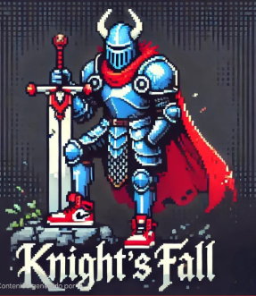

## _Game Design Document_

---

##### **Copyright notice / author information / boring legal stuff nobody likes**
Middle Earth Studios
- Santiago Coronado Hernández
- Juan de Dios Gastélum Flores 
- Enrique Antonio Pires Rodríguez
##
## _Index_

---

1. [Index](#index)
2. [Game Design](#game-design)
    1. [Summary](#summary)
    2. [Gameplay](#gameplay)
    3. [Mindset](#mindset)
3. [Technical](#technical)
    1. [Screens](#screens)
    2. [Controls](#controls)
    3. [Mechanics](#mechanics)
4. [Level Design](#level-design)
    1. [Themes](#themes)
        1. Ambience
        2. Objects
            1. Ambient
            2. Interactive
        3. Challenges
    2. [Game Flow](#game-flow)
5. [Development](#development)
    1. [Abstract Classes](#abstract-classes--components)
    2. [Derived Classes](#derived-classes--component-compositions)
6. [Graphics](#graphics)
    1. [Style Attributes](#style-attributes)
    2. [Graphics Needed](#graphics-needed)
7. [Sounds/Music](#soundsmusic)
    1. [Style Attributes](#style-attributes-1)
    2. [Sounds Needed](#sounds-needed)
    3. [Music Needed](#music-needed)
8. [Schedule](#schedule)

## _Game Design_

---

### **Summary**

Imagine the fun challenge of games like jump king but with the addictive gameplay of a roguelite. Welcome to Knight's Fall, where every leap is a gamble, and every fall is a lesson. 

You control a knight who must climb a mysterious tower to rescue the princess. However, the tower changes with each attempt: platforms, enemies, biomes and objects are randomly selected. As you climb, you'll unlock new jumping abilities that will make you feel more powerful. Can you break the cycle and reach the top?

### **Gameplay**

You'll be a knight that will enter a mysterious tower to save the princess, when you enter the tower, you will be met with a platforming level that you will have to climb, when climbing each level you will realize that many things change, the biome will change the further up you go and there will be enemies everywhere, but don't worry to much, because you will get harder to hit as well, you will get different types of jumps in each level, so that you can traverse the tower easier. If you die trying to save the princess, then pick yourself up and try again, beware that the platforms, biomes, enemy positions positions will change with each try, so give it your all to end the cycle of trying.

### **Mindset**

In this game, platforming will be the main gameplay, that is why we want our players to have difficulty at first (by having less tools to avoid the enemies, or by not being able to memorize the levels right away because they will be randomly selected), but feel more powerful as they play more (when they unlock movement tools). Also we want them to try completing the game as many times as possible, that is why we will be implementing a highscore system, so that the players can try and get highest score to flex on other players.

## _Technical_

---

### **Screens**

## 1. Login/Register Screen (HTML)
- **Description**: Initial screen where players can log in or register.
- **Elements**:
  - Text field for username.
  - Text field for password.
  - "Log In" button.
  - "Register" button.
- **Interaction**: Players enter their credentials to access the game.

---

## 2. Main Menu Screen (HTML)
- **Description**: Main screen with the game logo and menu options.
- **Elements**:
  - Game logo.
  - "Game" link.
  - "Statistics" link.
  - "Relevant Information" link.
  - "Leaderboard" link.
  - "Game Description and Controls" link.
- **Interaction**: Players select an option to navigate to the corresponding screen.

---

## 3. Game Screen (HTML)
- **Description**: Screen where the main level is played.
- **Elements**:
  - Game area.
  - HUD (Heads-Up Display) showing score and available powerups.
  - "Pause" button.
- **Interaction**: Players control the knight using the defined controls (A, D, SPACEBAR, Q).

---

## 4. Player Statistics Screen (HTML)
- **Description**: Screen where players can view their statistics.
- **Elements**:
  - Total time played (hour, minutes, and seconds).
  - Number of cumulative kills (integer).
  - Number of games completed (integer).
  - Number of games played (integer).
  - Personal best (best time and best score) (hour, minutes, and seconds for time and integer for score).
  - Number of enemies defeated (integer).
- **Interaction**: Players can review their progress and achievements.

---

## 5. Leaderboard Screen (HTML)
- **Description**: Screen that displays a leaderboard with the highest scores.
- **Elements**:
  - Table with player names, their scores and their time of completion.
- **Interaction**: Players can see how they compare to others.

---

## 6. Controls Screen and Game Description (HTML)
- **Description**: Screen that displays the game controls and the game description.
- **Elements**:
  - Table of controls (A, D, SPACEBAR, Q).
  - Brief description of each control.
  - Text describing the game premise.
  - Related images or graphics.
- **Interaction**: Players can read about the story and objective, and/or check the controls before playing.

---

### **Controls**

- **Movement**:
  - **A**: Move left.
  - **D**: Move right.
- **Jumps**:
  - **SPACEBAR**: Jump.
  - **Hold SPACEBAR**: Charge jump for a higher jump.
  - **SPACEBAR in the air**: Double jump.
- **Dash**:
  - **Q**: Perform a quick dash in the current direction.

**Note**: Controls are not customizable by the player.

---

### **Structure and Objective**

- **Structure**: A single level with different screens (sections) that change some things as the player progresses.
- **Objective**: Rescue the princess in the final section.

### **Mechanics**

## Gameloops
---
## Main Loop
You as the knight climb the tower to save the princess, you do this by jumping from platfrom to platform defeating or evading enemies, you also get powerups to make your journey in the tower more interesting.

## Knight Loop
The knight can move horizontally and vertically, the knight can also gain more movement options by using powerups, with all this tools the knight can reach different platforms to complete each screen or section.

## Screen Loop
The first two screens or sections will always be the same, so that the player can have some time to get used to the controls, at the end of that screen their will always be a powerup, but it will be random between the three powerups that we will create double jump, charged jump, and dash.

After that screen, each new screen will have a base (some platforms that will never change), and then an area that will be randomly generated based on the different movement tools the player has at the moment. Then the enemies will be randomly generated and the powerups will have a chance of spawining in a specific area.

That will continue until you reach the top were the screen will just be the floor and the princess at the other edge of the tower.

## Rules
- Powerups
    - There will be three powerups, double jump, charged jump and dash.
    - Double Jump: This powerup is the classic one, all you need to do is press SPACEBAR after making a jump to make a second one. The second jump will have half height as the first one. (This is tentative, will test when making the game).
 
    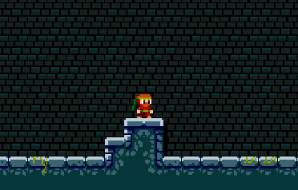
  
    - Charged Jump: With this powerup, you keep pressing SPACEBAR until you either cannot charge it anymore or you think that you have enough juice to make the cut. Then you just release SPACEBAR and see how high you jump. The charged jump will be 2 times the height of the normal jump at full charge. (This is tentative, will test when making the game).

    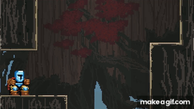
  
    - Dash: With this powerup you jump, after that all you need to do is press Q to move horizontally for a little while, after that time or distance is finished, you fall like normal. The dash will move to the direction you are pressing (a or d).
 
    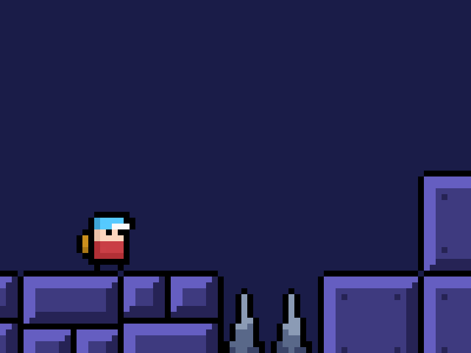

    - A limit that the three powerups will have is that they will not be able to be used at the same time, when the player uses one jump, a cooldown will start (for now we are thinking 3 seconds, but this will also be tested in the game), in that cooldown period, the player will only be able to move horizontally and use the normal jump.
- Platforms
    - The platforms will be completely interactable with the player (meaning that the player will never be able to jump through the platform from the bottom, the only way the player will be able to use the platform is to stand on top of it).
- Score
    - The score will have an impact in the gameplay, when the player reaches a threshold, they will receive a 2.5% increase in speed (by speed we mean horizontal movement), this will happen three times, so that if you have a good enough score, you can get a 7.5% increase in your horizontal movement.

|**Threshold**  |  **Increase in velocity**  |
|-----------|------------------------|
|1500       |   2.5%                 |
|3000       |   5.0%                 |
|4500       |   7.5%                 |

- Deaths
    - When the player dies, all the game will be reset, the only thing that will remain from your previous run will be the powerups you unlocked. The progress, increase in stats and other things will not be kept.
    - The player will die when the vertical velocity reaches a threshold (this number will be set when we test the game), which means that if the player falls from high enough, they will reach the threshold and die on impact.

## Interactions
- Player with Enemies
    - When enemies attack the player, the player will not have health, so the consequence of getting hit will be to be pushed some distance. If they are unlucky that push will make them fall to their death.
    - Also the player will be able to jump on enemies to kill them, for that to happen the player needs to land in top of it.

      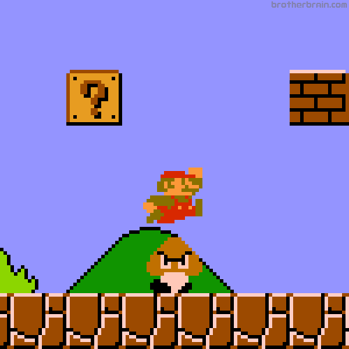

    - When the player kills an enemy, they will give the player some score to activate the velocity boost and to get on the leaderboards (this numbers are tentative)
    
|**Enemies**  |  **Score**           |
|-------------|----------------------|
|Skeleton     |   150                |
|Demon        |   400                |
|Jumper       |    250               |

- Player with Platforms
    - Like we said before, the player will only be able to stand on top of the platforms, they will not be able to pass through them in any capacity. Once the player is on top of the platform, they will use it to make the next jump.

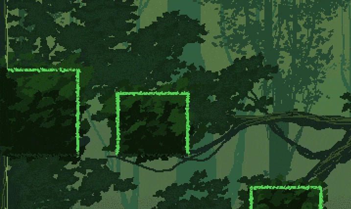

- Player with Powerups
    - The powerups will be objects that player can grab by walking into them, once the player touches them, they will be able to use them, but they will have the limit stated before (the cooldown stuff), so they will have to used them strategically.

- Player with Screens or Sections
    - When the player reaches the top of a screen, there will always be a section of the roff that is empty, the player will have to jump through that gap to get to the next screen.

    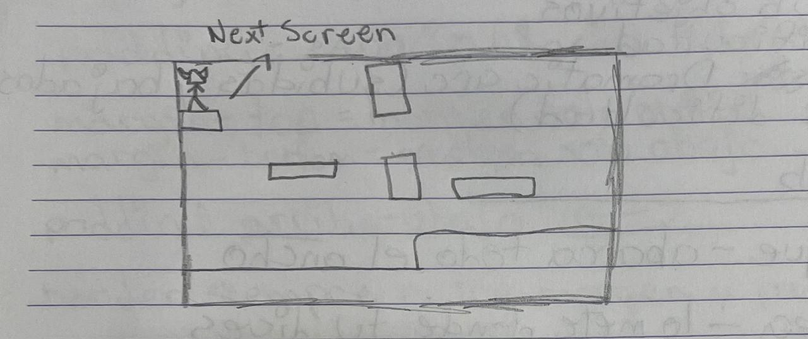

    - Also when the player completes a screen, the player will receive 100 points to get stat boosts and a leaderboard position. (The number is tentative)

## _Level Design_

---

_(Note : These sections can safely be skipped if they&#39;re not relevant, or you&#39;d rather go about it another way. For most games, at least one of them should be useful. But I&#39;ll understand if you don&#39;t want to use them. It&#39;ll only hurt my feelings a little bit.)_

### **Themes**

1. Tower
    1. Mood
        1. Medieval kinda Adventorous (because of music)
    2. Objects
        1. _Ambient_
            1. N/A :(
        2. _Interactive_
            1. Flying demons
            2. Skeletons
            3. Jumper

_(example)_

### **Game Flow**

1. Player starts at the bottom of the tower
2. Pass first two screens by jumping from platform to platform and killing or evading enemies
3. Take first powerup from the last platform of the second screen
4. Jump to the next screen were the level will take your jumps into account to generate its platforms
5. Complete each screen until you reach the top, while you are passing each screen you will be getting points by killing enemies, when you reach a certain number you will gain an increase in velocity, also you may encounter more powerups in the way so be sure to get them
6. Once you reach the top just walk to the right and save the princess

_(example)_

## _Development_

---

### **Abstract Classes / Components**

1. BasePhysics
    1. BasePlayer
    2. BaseEnemy
    3. BaseObject
2. BaseObstacle
3. BaseLevel

### **Derived Classes / Component Compositions**

1. BasePlayer
    1. PlayerMain
2. BaseEnemy
    1. EnemyDemon
    2. EnemySkeleton
    3. EnemyJumper
4. BaseObject
    1. ObjectPowerUp
    2. ObjectScore
5. BaseObstacle
    1. ObstacleWall

## _Graphics_

---

### **Style Attributes**

The characters will have a pixel-y design with attack, movement and death animations, the protagonist when jumping and moving will always make an animation, the enemies will always be moving and if you are in their range, they will attack you with an animation, the princess will have an animation that asks for rescue. The scenarios where the player will explore and interact with the castle will be pixel-y, with variations depending on what level you are, if you are in level 1, you will have a medieval atmosphere, in the second level you will change your environment for a frozen one and the last level will have a more lively style, because as you are approaching the princess, she will be in a better state.

### **Graphics Needed**

1. Characters
    1. Human-like
        1.	Knight (Stay, move, jumps, death, hit)
        2.	Princess (Celebration)
       
            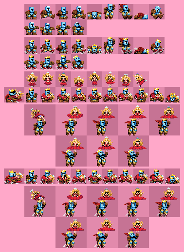
          	
    2.	Other
        1.	Skeleton(Move, attacks, hit, death)

            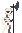
            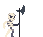
            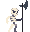
            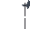

        2.	Demon (Fly, hit, death)

            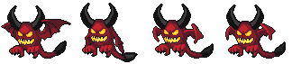
          	
            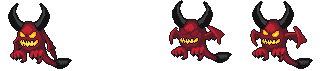
          	
            

        3.	Jumper (Jump)
           
          	
          	
3.	Blocks
    1.	Brick
    2.	Stone
    3.	Walls
4. Powerups
    1. Double Jump
       
       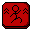
       
    2. Charged Jump
     
       
       
    3. Dash
   
       
       
    5. Bar with PowerUps
5.	Ambient
    1.	Tower (Medieval, Pixel-Art and Fantasy)

## _Sounds/Music_

## **i. Style Attributes**  
A consistent **16-bit medieval-style** soundtrack will be maintained throughout the game. Various sound effects will be used in different mechanics to provide the player with responsive audio feedback for their actions.  

- **Sound Effects:**  
  - Will provide feedback to the player about their actions.  
  - When colliding with an enemy, the player does not take damage but is pushed back, so they will hear a responsive sound corresponding to the push.  

- **Music:**  
  - A single medieval-style song will be used throughout the entire game.  
  - The song will be immersive to prevent auditory fatigue.  

---

## **ii. Sounds Needed**  

### **1. Effects**  

#### **Movement**  
- **i.** Soft footsteps (dirt, wood, stone).  
- **ii.** Jump sound.  
- **iii.** Charging sound for the charged jump.  
- **iv.** Double jump sound.  
- **v.** Dash sound.  

#### **Falls and Landings**  
- **vi.** Soft landing (low fall impact).  
- **vii.** Mortal fall sound.  

#### **Enemy Interactions**  
- **viii.** Push sound when colliding with an enemy.  
- **ix.** Enemy-specific sounds.  

---

## **iii. Music Needed**  

### **1. Main Theme**  
- A single track will be used throughout the entire game.  
- Medieval ambiance.  
- Moderate rhythm to avoid auditory fatigue.  

### **2. Menu Theme**  
- A calmer variation of the main theme with reduced instrumentation.  

### **3. Game Over Theme**  
- A short sound fragment that indicates the end of the game without being frustrating.

## _Schedule_

---

_(define the main activities and the expected dates when they should be finished. This is only a reference, and can change as the project is developed)_

1. Make Entity Relationship Model (14/03/2025)
2. Make Draft of DataBase with Dummy Data (24/03/2025)
3. develop base classes
    1. BasePhysics 
        1. BasePlayer
        2. BaseEnemy
        3. BaseObject
    2. BaseObstacle    
    3. BaseLevel 
4. base web page state 
    1. Log in screen 
    2. Main screen 
5. develop the base of the game
    1. physics / collisions 
6. find some smooth controls/physics 
7. develop other derived classes 
    1. PlayerMain 
    2. EnemySkeleton
    3. EnemyDemon
    4. EnemyJumper
    5. ObjectStats
    6. ObjectScore
    7. ObstacleWall
8. design levels
    1. introduce motion/jumping
    2. introduce powerups
    3. mind the pacing, let the player play between lessons
9.  Make API
10. Make other screens of web page
11. design sounds
12. design music

_(example)_
