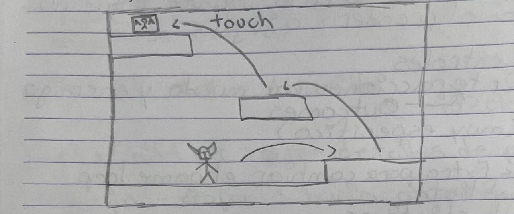

# **Knight's Fall**

## _Documento de Diseño del Juego_

---

##### **Aviso de derechos de autor / información del autor / cosas legales aburridas que a nadie le gustan**
Middle Earth Studios
- Santiago Coronado Hernández
- Juan de Dios Gastélum Flores 
- Enrique Antonio Pires Rodríguez

##
## _Índice_

---

1. [Índice](#índice)
2. [Diseño del Juego](#diseño-del-juego)
    1. [Resumen](#resumen)
    2. [Gameplay](#gameplay)
    3. [Mentalidad](#mentalidad)
3. [Técnico](#técnico)
    1. [Pantallas](#pantallas)
    2. [Controles](#controles)
    3. [Mecánicas](#mecánicas)
4. [Diseño de Niveles](#diseño-de-niveles)
    1. [Temas](#temas)
        1. Ambiente
        2. Objetos
            1. Ambientales
            2. Interactivos
        3. Desafíos
    2. [Flujo del Juego](#flujo-del-juego)
5. [Desarrollo](#desarrollo)
    1. [Clases Abstractas](#clases-abstractas--componentes)
    2. [Clases Derivadas](#clases-derivadas--composiciones-de-componentes)
6. [Gráficos](#gráficos)
    1. [Atributos de Estilo](#atributos-de-estilo)
    2. [Gráficos Necesarios](#gráficos-necesarios)
7. [Sonidos/Música](#sonidosmúsica)
    1. [Atributos de Estilo](#atributos-de-estilo-1)
    2. [Sonidos Necesarios](#sonidos-necesarios)
    3. [Música Necesaria](#música-necesaria)
8. [Cronograma](#cronograma)

## _Diseño del Juego_

---

### **Resumen**

Imagina el desafío divertido de juegos como *Jump King* pero con la jugabilidad adictiva de un *roguelite*. Bienvenido a *Knight's Fall*, donde cada salto es una apuesta y cada caída es una lección.

Controlas a un caballero que debe escalar una torre misteriosa para rescatar a la princesa. Sin embargo, la torre cambia con cada intento: plataformas, enemigos, biomas y objetos se seleccionan al azar. A medida que escalas, desbloquearás nuevas habilidades de salto que te harán sentir más poderoso. ¿Puedes romper el ciclo y llegar a la cima?

### **Gameplay**

Serás un caballero que entra en una torre misteriosa para salvar a la princesa. Al entrar, te encontrarás con un nivel de plataformas que tendrás que escalar. A medida que avanzas, notarás que muchas cosas cambian: el bioma cambia cuanto más subes y hay enemigos por todas partes. Pero no te preocupes demasiado, porque te volverás más difícil de golpear. Obtendrás diferentes tipos de saltos en cada nivel para facilitar el recorrido de la torre. Si mueres intentando salvar a la princesa, levántate e inténtalo de nuevo. Ten en cuenta que las plataformas, biomas y posiciones de los enemigos cambiarán con cada intento, así que da lo mejor de ti para terminar el ciclo de intentos.

### **Mentalidad**

En este juego, las plataformas serán la jugabilidad principal. Por eso queremos que los jugadores tengan dificultad al principio (al tener menos herramientas para evitar enemigos o al no poder memorizar los niveles de inmediato porque se seleccionarán al azar), pero que se sientan más poderosos a medida que juegan más (cuando desbloquean herramientas de movimiento). También queremos que intenten completar el juego tantas veces como sea posible, por lo que implementaremos un sistema de puntuación alta para que los jugadores puedan intentar obtener la puntuación más alta y presumir ante otros jugadores.

## _Técnico_

---

### **Pantallas**

## 1. Pantalla de Inicio de Sesión/Registro (HTML)
- **Descripción**: Pantalla inicial donde los jugadores pueden iniciar sesión o registrarse.
- **Elementos**:
  - Campo de texto para el nombre de usuario.
  - Campo de texto para la contraseña.
  - Botón "Iniciar Sesión".
  - Botón "Registrarse".
- **Interacción**: Los jugadores ingresan sus credenciales para acceder al juego.

---

## 2. Pantalla del Menú Principal (HTML)
- **Descripción**: Pantalla principal con el logo del juego y las opciones del menú.
- **Elementos**:
  - Logo del juego.
  - Enlace "Juego".
  - Enlace "Estadísticas".
  - Enlace "Información Relevante".
  - Enlace "Tabla de Clasificación".
  - Enlace "Descripción del Juego y Controles".
- **Interacción**: Los jugadores seleccionan una opción para navegar a la pantalla correspondiente.

---

## 3. Pantalla del Juego (HTML)
- **Descripción**: Pantalla donde se juega el nivel principal.
- **Elementos**:
  - Área del juego.
  - HUD (Heads-Up Display) que muestra la puntuación y los powerups disponibles.
  - Botón "Pausa".
- **Interacción**: Los jugadores controlan al caballero usando los controles definidos (A, D, SPACEBAR, Q).

---

## 4. Pantalla de Estadísticas del Jugador (HTML)
- **Descripción**: Pantalla donde los jugadores pueden ver sus estadísticas.
- **Elementos**:
  - Tiempo total jugado (horas, minutos y segundos).
  - Número de muertes acumuladas (entero).
  - Número de juegos completados (entero).
  - Número de juegos jugados (entero).
  - Mejor puntuación personal (mejor tiempo y mejor puntuación) (horas, minutos y segundos para el tiempo y entero para la puntuación).
  - Número de enemigos derrotados (entero).
- **Interacción**: Los jugadores pueden revisar su progreso y logros.

---

## 5. Pantalla de Tabla de Clasificación (HTML)
- **Descripción**: Pantalla que muestra una tabla de clasificación con las puntuaciones más altas.
- **Elementos**:
  - Tabla con nombres de jugadores, sus puntuaciones y su tiempo de finalización.
- **Interacción**: Los jugadores pueden ver cómo se comparan con otros.

---

## 6. Pantalla de Controles y Descripción del Juego (HTML)
- **Descripción**: Pantalla que muestra los controles del juego y la descripción del juego.
- **Elementos**:
  - Tabla de controles (A, D, SPACEBAR, Q).
  - Breve descripción de cada control.
  - Texto que describe la premisa del juego.
  - Imágenes o gráficos relacionados.
- **Interacción**: Los jugadores pueden leer sobre la historia y el objetivo, y/o revisar los controles antes de jugar.

---

### **Controles**

- **Movimiento**:
  - **A**: Moverse a la izquierda.
  - **D**: Moverse a la derecha.
- **Saltos**:
  - **SPACEBAR**: Saltar.
  - **Mantener SPACEBAR**: Cargar salto para un salto más alto.
  - **SPACEBAR en el aire**: Doble salto.
- **Dash**:
  - **Q**: Realizar un dash rápido en la dirección actual.

**Nota**: Los controles no son personalizables por el jugador.

---

### **Estructura y Objetivo**

- **Estructura**: Un solo nivel con diferentes pantallas (secciones) que cambian algunas cosas a medida que el jugador avanza.
- **Objetivo**: Rescatar a la princesa en la sección final.

---

### **Mecánicas**

## Bucles de Juego
---
## Bucle Principal
Tú, como el caballero, escalas la torre para salvar a la princesa. Lo haces saltando de plataforma en plataforma, derrotando o evadiendo enemigos. También obtienes powerups para hacer tu viaje en la torre más interesante.

## Bucle del Caballero
El caballero puede moverse horizontal y verticalmente. También puede obtener más opciones de movimiento usando powerups. Con todas estas herramientas, el caballero puede alcanzar diferentes plataformas para completar cada pantalla o sección.

## Bucle de Pantalla
Las primeras dos pantallas o secciones siempre serán las mismas, para que el jugador tenga tiempo de acostumbrarse a los controles. Al final de esa pantalla, siempre habrá un powerup, pero será aleatorio entre los tres powerups que crearemos: doble salto, salto cargado y dash.

Después de esa pantalla, cada nueva pantalla tendrá una base (algunas plataformas que nunca cambian) y luego un área que se generará aleatoriamente según las diferentes herramientas de movimiento que el jugador tenga en ese momento. Luego, los enemigos se generarán aleatoriamente y los powerups tendrán una posibilidad de aparecer en un área específica.

Esto continuará hasta que llegues a la cima, donde la pantalla será solo el suelo y la princesa al otro borde de la torre.

## Reglas
- Powerups
    - Habrá tres powerups: doble salto, salto cargado y dash.
    - Doble Salto: Este powerup es el clásico. Solo necesitas presionar SPACEBAR después de hacer un salto para hacer un segundo salto. El segundo salto tendrá la mitad de altura que el primero. (Esto es tentativo, se probará al hacer el juego).
  
    
  
    - Salto Cargado: Con este powerup, mantienes presionado SPACEBAR hasta que no puedas cargarlo más o creas que tienes suficiente energía para hacer el salto. Luego, sueltas SPACEBAR y ves qué tan alto saltas. El salto cargado será 2 veces la altura del salto normal al máximo de carga. (Esto es tentativo, se probará al hacer el juego).

    
  
    - Dash: Con este powerup, saltas y luego presionas Q para moverte horizontalmente por un corto tiempo. Después de ese tiempo o distancia, caes como normalmente. El dash se moverá en la dirección que estés presionando (A o D).
 
    

    - Un límite que tendrán los tres powerups es que no podrán usarse al mismo tiempo. Cuando el jugador usa un salto, comenzará un tiempo de enfriamiento (por ahora estamos pensando en 3 segundos, pero esto también se probará en el juego). Durante ese período de enfriamiento, el jugador solo podrá moverse horizontalmente y usar el salto normal.
- Plataformas
    - Las plataformas serán completamente interactuables con el jugador (lo que significa que el jugador nunca podrá saltar a través de la plataforma desde abajo. La única forma en que el jugador podrá usar la plataforma es parándose sobre ella).
- Puntuación
    - La puntuación tendrá un impacto en la jugabilidad. Cuando el jugador alcance un umbral, recibirá un aumento del 2.5% en la velocidad (por velocidad nos referimos al movimiento horizontal). Esto sucederá tres veces, por lo que si tienes una puntuación lo suficientemente buena, puedes obtener un aumento del 7.5% en tu movimiento horizontal.

|**Umbral**  |  **Aumento de Velocidad**  |
|-----------|------------------------|
|1500       |   2.5%                 |
|3000       |   5.0%                 |
|4500       |   7.5%                 |

- Muertes
    - Cuando el jugador muere, todo el juego se reiniciará. Lo único que permanecerá de tu partida anterior serán los powerups que desbloqueaste. El progreso, el aumento de estadísticas y otras cosas no se conservarán.
    - El jugador morirá cuando la velocidad vertical alcance un umbral (este número se establecerá cuando probemos el juego), lo que significa que si el jugador cae desde una altura suficiente, alcanzará el umbral y morirá al impactar.

## Interacciones
- Jugador con Enemigos
    - Cuando los enemigos atacan al jugador, el jugador no tendrá salud, por lo que la consecuencia de ser golpeado será ser empujado una cierta distancia. Si tienen mala suerte, ese empujón los hará caer y morir.
    - Además, el jugador podrá saltar sobre los enemigos para matarlos. Para que esto suceda, el jugador debe aterrizar encima de ellos.

      

    - Cuando el jugador mata a un enemigo, le dará algo de puntuación para activar el aumento de velocidad y para subir en la tabla de clasificación (estos números son tentativos).
    
|**Enemigos**  |  **Puntuación**           |
|-------------|----------------------|
|Esqueleto     |   150                |
|Demonio        |   400                |
|Saltador       |    250               |

- Jugador con Plataformas
    - Como dijimos antes, el jugador solo podrá pararse sobre las plataformas. No podrá atravesarlas de ninguna manera. Una vez que el jugador esté sobre la plataforma, la usará para hacer el siguiente salto.

- Jugador con Powerups
    - Los powerups serán objetos que el jugador puede agarrar caminando hacia ellos. Una vez que el jugador los toca, podrá usarlos, pero tendrán el límite mencionado anteriormente (el tiempo de enfriamiento), por lo que tendrán que usarlos estratégicamente.

- Jugador con Pantallas o Secciones
    - Cuando el jugador llega a la parte superior de una pantalla, siempre habrá una sección del techo que estará vacía. El jugador tendrá que saltar a través de ese espacio para llegar a la siguiente pantalla.

    

    - Además, cuando el jugador completa una pantalla, recibirá 100 puntos para obtener aumentos de estadísticas y una posición en la tabla de clasificación. (El número es tentativo).

## _Diseño de Niveles_

---

_(Nota: Estas secciones pueden omitirse si no son relevantes o prefieres abordarlo de otra manera. Para la mayoría de los juegos, al menos una de ellas debería ser útil. Pero entenderé si no quieres usarlas. Solo lastimarás mis sentimientos un poco)._

### **Temas**

1. Torre
    1. Ambiente
        1. Medieval, algo aventurero (por la música)
    2. Objetos
        1. _Ambientales_
            1. N/A :(
        2. _Interactivos_
            1. Demonios voladores
            2. Esqueletos
            3. Saltadores

_(ejemplo)_

### **Flujo del Juego**

1. El jugador comienza en la base de la torre.
2. Pasa las primeras dos pantallas saltando de plataforma en plataforma y matando o evadiendo enemigos.
3. Toma el primer powerup desde la última plataforma de la segunda pantalla.
4. Salta a la siguiente pantalla, donde el nivel tendrá en cuenta tus saltos para generar sus plataformas.
5. Completa cada pantalla hasta llegar a la cima. Mientras pasas cada pantalla, obtendrás puntos matando enemigos. Cuando alcances un cierto número, obtendrás un aumento de velocidad. También puedes encontrar más powerups en el camino, así que asegúrate de agarrarlos.
6. Una vez que llegues a la cima, solo camina hacia la derecha y salva a la princesa.

_(ejemplo)_

## _Desarrollo_

---

### **Clases Abstractas / Componentes**

1. BasePhysics
    1. BasePlayer
    2. BaseEnemy
    3. BaseObject
2. BaseObstacle
3. BaseLevel

### **Clases Derivadas / Composiciones de Componentes**

1. BasePlayer
    1. PlayerMain
2. BaseEnemy
    1. EnemyDemon
    2. EnemySkeleton
    3. EnemyJumper
4. BaseObject
    1. ObjectPowerUp
    2. ObjectScore
5. BaseObstacle
    1. ObstacleWall

## _Gráficos_

---

### **Atributos de Estilo**

Los personajes tendrán un diseño pixelado con animaciones de ataque, movimiento y muerte. El protagonista, al saltar y moverse, siempre hará una animación. Los enemigos siempre se estarán moviendo, y si estás en su rango, te atacarán con una animación. La princesa tendrá una animación pidiendo rescate. Los escenarios donde el jugador
